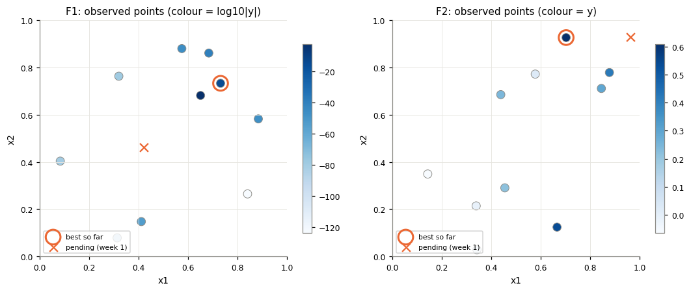
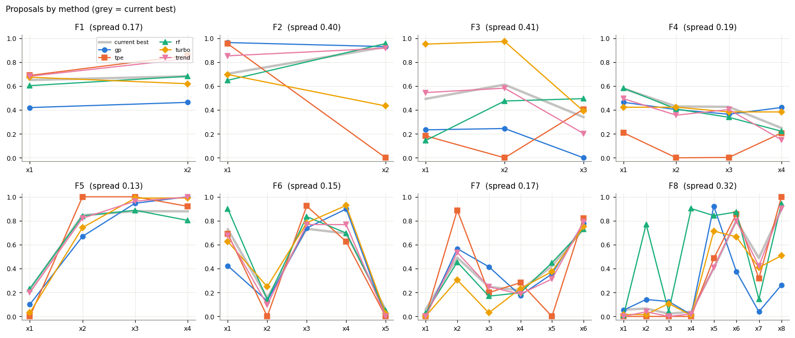
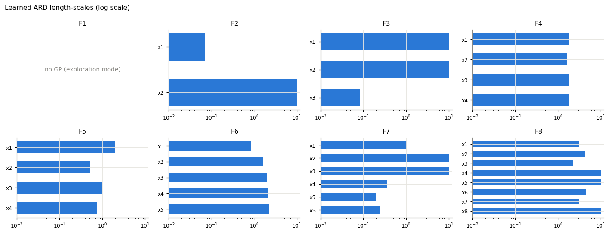
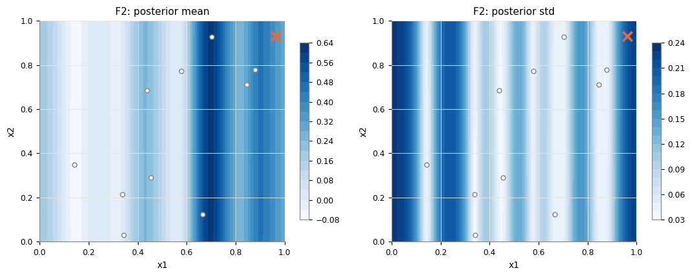
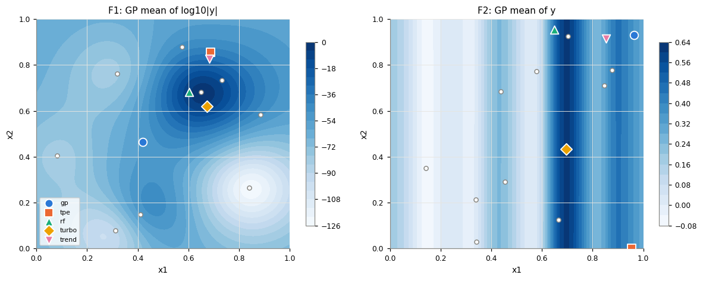

# Black-Box Optimisation Capstone: Finding the Maxima of Eight Unknown Functions

## NON-TECHNICAL EXPLANATION OF THE PROJECT

Imagine trying to find the best recipe, machine setting or drug dose when every test is slow and expensive, and you can't see how the process works inside. This project tackles eight such "black box" problems, ranging from locating a radiation source to tuning a machine-learning model. For each one I get a handful of past results and just one new test per week. Rather than guessing, I build a statistical "map" of each problem from the results so far. The map shows both where the best answer probably lies and where I am still uncertain. I then choose each week's test to balance improving on known good settings against exploring the unknown.

## DATA

The data was provided by the capstone programme as part of a Bayesian-optimisation-style challenge. It is synthetic: each function is an unknown mathematical function written by the course team to imitate a real-world problem. No external datasets were used.

| Function | Inputs | Starting points | Real-world analogy (from the brief)                                             |
| -------- | ------ | --------------- | ------------------------------------------------------------------------------- |
| 1        | 2      | 10              | Detecting contamination (e.g. radiation) sources: signal only near a source     |
| 2        | 2      | 10              | Noisy log-likelihood of a mystery ML model, with local optima                   |
| 3        | 3      | 15              | Drug discovery: minimise adverse reactions (outputs negated)                    |
| 4        | 4      | 30              | Warehouse product placement: ML approximation of an expensive calculation       |
| 5        | 4      | 20              | Chemical process yield (typically one peak)                                     |
| 6        | 5      | 20              | Cake recipe: negative score from flavour, consistency, calories, waste and cost |
| 7        | 6      | 30              | Tuning six ML hyperparameters                                                   |
| 8        | 8      | 40              | Tuning eight ML hyperparameters (e.g. learning rate, dropout, optimiser type)   |

**Format:** for each function, `initial_inputs.npy` (an n × d array, with every input in [0, 1]) and `initial_outputs.npy` (n values). Every task is a **maximisation**.
Growth:** each week I submit one query per function through the portal, formatted as six-decimal values joined by hyphens (e.g. `0.419675-0.463269`), and receive one new output. All submissions and results are recorded in the `HISTORY` cell of the notebook.
**Notable properties of the starting data:**
- Function 1 is almost zero everywhere (1e-124 to 1e-15).
- Function 5 spans four orders of magnitude (0.1 to 1089).
- Function 8 is close to linear (a straight-line fit explains 90% of the variance).

_Starting data for Functions 1 and 2. Colour shows the output: log10|y| for F1, y for F2. The orange circle marks the best point and the × marks the pending Week 1 query._

## MODEL

**Primary model: a Gaussian Process (GP) surrogate with Bayesian optimisation.**
A GP predicts the output at any input **together with an uncertainty**. With only 10–40 expensive observations, that uncertainty is what makes principled exploration possible, so a GP was the natural choice. My configuration:

- **Matern 5/2 kernel with ARD** (a separate length-scale for each input). It assumes a realistically, not perfectly, smooth function, and the learned length-scales show which inputs matter.
- **A white-noise term**, for noisy functions such as Function 2 and for numerical stability.
- **Normalised outputs**, plus a **log transform** for Function 5 because of its huge range.
- **Leave-one-out validation** (Spearman correlation) to measure how far each function's GP can be trusted.

An **acquisition function** turns the GP's prediction and uncertainty into a score for each candidate point: Expected Improvement (EI) or Upper Confidence Bound (UCB). I score about 60,000 candidates per function, drawn globally and around the best known points, and submit the best.

**Four alternative strategies are run as cross-checks every week**, because one model can be misled by so little data:
| Method | Idea | Why include it |
|---|---|---|
| TPE (Tree-structured Parzen Estimator) | Models the density of "good" and "bad" inputs | Standard in hyperparameter-tuning tools, robust in higher dimensions |
| Random Forest (the idea behind SMAC) | A tree ensemble, with the spread between trees as the uncertainty | Handles thresholds and discrete-like inputs |
| TuRBO-style trust region | GP search in a box that grows after successes and shrinks after failures | Built for high dimensions with small budgets |
| Linear trend-following | A step up the fitted gradient | A simple, transparent baseline |

When the methods agree, I exploit confidently. When they disagree, I stay closer to what has worked.

_Where each of the five methods proposes to query in Week 1. Overlapping lines mean the methods agree._

## HYPERPARAMETER OPTIMISATION

The project involves two layers of hyperparameters.
**1. Surrogate-model hyperparameters, fitted automatically.** The GP's amplitude, one length-scale per input and its noise level are all fitted by **maximising the marginal likelihood**, using L-BFGS with 15 random restarts to avoid poor local fits. Length-scales are bounded to [0.02, 10] and noise to [1e-6, 0.1]. The fitted length-scales are useful in themselves: a short one marks an important input, and one at the upper bound marks an input the model considers irrelevant.

_Learned ARD length-scales (log scale). A shorter bar means a more important input._
**2. Optimisation-strategy hyperparameters, set per function and reviewed weekly.** These control the balance between exploration and exploitation. They are set by reasoning from each function's brief and data, not by automated tuning, because every evaluation costs a week.
| Setting | Role | Week 1 choice |
|---|---|---|
| Acquisition function | EI (balanced) or UCB (explicit exploration) | EI for F3–F6, UCB for F2, F7 and F8 |
| κ (UCB) / ξ (EI) | Exploration strength | κ = 2, ξ = 0.01 |
| Trust region | Limits the search to ±`tr` around the best point | ±0.2 for F5, where the GP was unreliable (LOO 0.23) |
| Output transform | Makes wide-ranging outputs easier to model | log(y) for F5 |
| Exploration mode | Maximin space-filling while there is no signal | F1, until any \|y\| > 0.01 |
| TuRBO box size L | Adapts automatically: ×1.5 after an improvement, ×0.7 after a failure | Starts at 0.4 |
**Weekly adjustment rule:**

- Where a query improves on the best, I lower κ or ξ and shrink the search region (exploit).
- Where a function stalls for 2–3 weeks, I raise them (explore).
- To choose each final query, I follow the GP where it predicts well (LOO ≥ 0.7), take the consensus of the five methods where they agree, and use TuRBO where they disagree. I can override this with a written reason.

Functions 7 and 8 are themselves ML hyperparameter-tuning problems, so this project is also a small case study in **Bayesian hyperparameter optimisation**.

## WEEKLY RESULTS JUORNAL

**Week 1 queries and the reasoning behind them:**
| Function | Best starting value | Week 1 query | Strategy | GP prediction |
|---|---|---|---|---|
| 1 | 7.7e-16 | `0.419675-0.463269` | Explore: fill the largest gap | n/a (no signal) |
| 2 | 0.611 | `0.963166-0.929385` | Explore the uncertain high-x1 edge | 0.35 ± 0.21 |
| 3 | -0.035 | `0.233668-0.244902-0.000006` | Test an edge optimum at x3 → 0 | -0.058 ± 0.084 |
| 4 | -4.03 | `0.463911-0.402868-0.364200-0.420348` | Refine the central peak | -1.89 ± 0.75 |
| 5 | 1089 | `0.100499-0.668722-0.946097-0.999999` | Push x3 and x4 higher, within the trust region | ~2500 (log-space, uncertain) |
| 6 | -0.714 | `0.423548-0.129091-0.738806-0.897785-0.000000` | Follow the low-x5, high-x3/x4 trend | -0.23 ± 0.29 |
| 7 | 1.365 | `0.000000-0.566788-0.415090-0.175728-0.355442-0.779021` | Probe around the single standout point | 1.27 ± 0.14 |
| 8 | 9.60 | `0.052325-0.141964-0.124313-0.014745-0.921651-0.374929-0.039243-0.262463` | Exploit the linear trend (low x1, x3, x7) | 10.19 ± 0.22 |
**What I have learned so far:**

- **Model reliability varies a lot.** The GP ranks unseen points very well for Functions 4 (LOO 0.97) and 8 (0.98), but poorly for Function 5 (0.23). One method does not suit all eight functions.
- **Simple checks catch model errors.** For Function 5, the GP wanted to jump to a far corner that contradicted a clear trend in the data. A trust region prevented it.
- **The right output transform can reveal hidden structure.** Function 1 looks flat, but on a log scale its readings rise steadily towards (0.60–0.69, 0.62–0.85). All four alternative methods point there, and it is the planned next target if the centre query returns about zero.
- **Few inputs may really matter.** The GP judges x2 irrelevant for Function 2, x1 and x2 for Function 3, and x4, x5 and x8 for Function 8. That effectively reduces those search spaces.
- **Pipeline weaknesses found and scheduled for fixing:** clipping candidate points onto the edges slightly biases queries towards 0 or 1, and random-candidate acquisition search is imprecise in 6–8 dimensions. I will fix the first and add gradient-based refinement for the second.

_Function 2 GP posterior mean (left) and uncertainty (right). The model treats x2 as irrelevant, which produces the vertical stripes. The Week 1 query (orange ×) tests the uncertain right-hand edge._

_Proposals from all five methods on the 2D functions. For Function 1, four methods agree on the region where readings increase._

### Repository contents

| File                          | Description                                                                                                                                   |
| ----------------------------- | --------------------------------------------------------------------------------------------------------------------------------------------- |
| `capstone_bbo.ipynb`          | Full weekly pipeline: data, exploratory analysis, GP, acquisition, five-method comparison, final selection, progress tracking and reflections |
| `function_1/` … `function_8/` | Initial `.npy` data                                                                                                                           |
| `images/`                     | Figures used in this README                                                                                                                   |

**To run it:** `pip install numpy pandas scipy scikit-learn matplotlib jupyter`, then open the notebook next to the `function_*` folders and run all cells.
